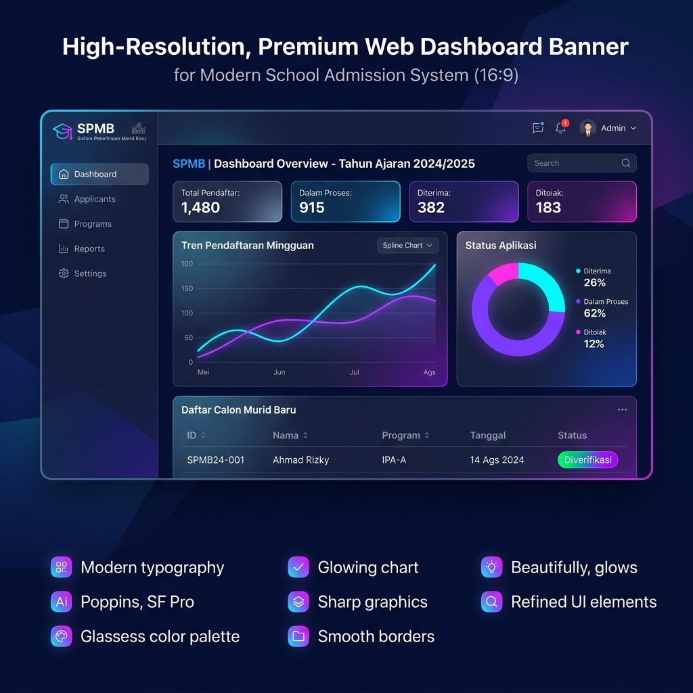
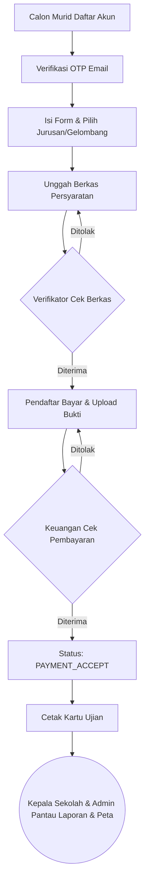

# 🎓 Sistem Penerimaan Murid Baru (SPMB) - SMK/SMA XYZ



[](https://laravel.com)
[](https://php.net)
[](https://getbootstrap.com)
[](https://mysql.com)
[](LICENSE)

**Sistem Penerimaan Murid Baru (SPMB)** adalah aplikasi berbasis web yang dirancang khusus untuk mengelola, menyederhanakan, dan mengotomatisasi seluruh alur proses pendaftaran murid baru di SMK/SMA XYZ secara online. Mulai dari pendaftaran akun, pengisian formulir, unggah berkas persyaratan, verifikasi administrasi, pembayaran biaya masuk, hingga cetak kartu pendaftaran ujian secara digital.

Aplikasi ini mendukung **Multi-Role System** dengan 5 level hak akses pengguna untuk memastikan koordinasi yang mulus antara calon murid dan panitia seleksi sekolah.

---

## 📌 Fitur Utama Berdasarkan Peran

### 1. 🧑‍🎓 Calon Murid (Pendaftar)
* **Registrasi & Keamanan**: Pembuatan akun dengan sistem verifikasi **One-Time Password (OTP)** yang dikirim ke email aktif.
* **Formulir Terpadu**: Pengisian data diri lengkap, data orang tua/wali, data asal sekolah, serta pemilihan jurusan dan gelombang aktif.
* **Unggah Berkas**: Pengunggahan dokumen syarat (Ijazah/SKL, Akta Kelahiran, Kartu Keluarga, dan KIP) dengan validasi tipe file dan ukuran (maks 5MB).
* **Manajemen Pembayaran**: Unggah bukti transfer pembayaran pendaftaran sesuai tarif gelombang yang diikuti.
* **Cek Status Real-time**: Memantau perkembangan berkas (apakah diterima, ditolak, atau perlu perbaikan).
* **Cetak Kartu Ujian**: Mengunduh dan mencetak Kartu Pendaftaran resmi setelah seluruh proses validasi selesai.

### 2. ⚡ Administrator (Admin)
* **Dashboard Statistik**: Memantau jumlah pendaftar harian, grafik sebaran per jurusan, dan status verifikasi secara real-time.
* **Master Jurusan**: Mengelola daftar program keahlian/jurusan beserta kuota daya tampung masing-masing.
* **Master Gelombang**: Mengatur masa aktif pendaftaran, tanggal mulai/selesai, serta tarif biaya pendaftaran.
* **Kelola User**: Manajemen user internal sekolah (menambah, mengedit, atau menonaktifkan akun panitia).
* **Peta Sebaran Wilayah**: Visualisasi asal domisili pendaftar menggunakan integrasi map interaktif.
* **Log Aktivitas**: Audit trail lengkap yang merekam seluruh aksi krusial yang dilakukan oleh pengguna di dalam sistem.

### 3. 🔍 Verifikator Administrasi
* **Validasi Berkas**: Pemeriksaan kesesuaian dokumen (Ijazah, Akta, KK) secara digital.
* **Sistem Checklist & Catatan**: Memberikan status valid/tidak valid per dokumen dan menyertakan catatan koreksi spesifik jika berkas ditolak agar pendaftar tahu bagian mana yang harus diperbaiki.
* **Riwayat Verifikasi**: Rekap pendaftar yang telah diverifikasi beserta status akhirnya.

### 4. 💰 Staff Keuangan
* **Verifikasi Transaksi**: Memvalidasi bukti transfer pendaftar secara manual dan mencocokkannya dengan mutasi rekening sekolah.
* **Penerimaan/Penolakan Pembayaran**: Mengubah status pendaftaran calon siswa menjadi lunas (`PAYMENT_ACCEPT`) atau menolak bukti bayar yang tidak valid (`PAYMENT_REJECT`).
* **Rekapitulasi Keuangan**: Laporan arus kas masuk berdasarkan gelombang aktif.

### 5. 👑 Kepala Sekolah
* **Overview Executive**: Dashboard pemantauan perkembangan pendaftaran dengan grafik interaktif tanpa hak mengubah data (Read-only monitoring).
* **Ekspor Laporan**: Mengunduh laporan pendaftaran lengkap dalam format Microsoft Excel.

---

## 🏗️ Tech Stack & Library

* **Backend Framework**: [Laravel v11.0](https://laravel.com/) (PHP >= 8.2)
* **Database**: MySQL / MariaDB
* **Frontend styling**: Vanilla CSS & [Bootstrap v4.6](https://getbootstrap.com/)
* **Charts & Analytics**: [Chart.js](https://www.chartjs.org/)
* **Integrations**:
  * PHPMailer / Laravel Mail (untuk OTP Registrasi)
  * Leaflet.js / OpenStreetMap (untuk Peta Sebaran Pendaftar)
  * Laravel Excel (untuk ekspor laporan xlsx)

---

## 🔄 Alur Proses Sistem (System Flow)



---

## 💻 Panduan Instalasi & Menjalankan Project

### Prasyarat (Prerequisites)
Pastikan Anda sudah menginstal aplikasi pendukung berikut di komputer Anda:
* PHP >= 8.2 (dilengkapi extension pdo, openssl, mbstring, xml, curl, gd, zip)
* Composer (Dependency Manager untuk PHP)
* MySQL / Web Server lokal seperti XAMPP atau Laragon
* Git (opsional)

### Langkah-langkah Instalasi

1. **Clone Repository / Unduh Source Code**
   ```bash
   git clone https://github.com/rasyidiraya/spmb_bn_bY_rasit.git
   cd spmb_bn_bY_rasit
   ```

2. **Instal Dependensi Composer**
   ```bash
   composer install
   ```

3. **Konfigurasi Environment (`.env`)**
   Salin file `.env.example` menjadi `.env`:
   ```bash
   cp .env.example .env
   ```
   Buka file `.env` yang baru dibuat dan sesuaikan konfigurasi koneksi database Anda:
   ```env
   DB_CONNECTION=mysql
   DB_HOST=127.0.0.1
   DB_PORT=3306
   DB_DATABASE=db_spmb
   DB_USERNAME=root
   DB_PASSWORD=
   ```
   *Pastikan juga konfigurasi email (`MAIL_HOST`, `MAIL_PORT`, `MAIL_USERNAME`, `MAIL_PASSWORD`) sudah terisi dengan benar untuk fitur pengiriman OTP.*

4. **Generate Application Key**
   ```bash
   php artisan key:generate
   ```

5. **Buat Database**
   Buat database baru di MySQL Server Anda dengan nama sesuai konfigurasi `.env` (misal: `db_spmb`).

6. **Migrasi Database & Seeding Data Awal**
   Jalankan migrasi untuk membuat tabel beserta data master/akun uji coba bawaan:
   ```bash
   php artisan migrate --seed
   ```
   *Proses seed ini akan mengisi data wilayah Indonesia, daftar jurusan default, gelombang aktif, serta akun panitia sekolah.*

7. **Jalankan Aplikasi**
   Gunakan built-in server Laravel untuk menjalankan aplikasi secara lokal:
   ```bash
   php artisan serve
   ```
   Aplikasi dapat diakses melalui browser di alamat: [http://127.0.0.1:8000](http://127.0.0.1:8000)
   
   *(Jika menggunakan XAMPP, Anda juga bisa mengaksesnya via: `http://localhost/spmb_bn_bY_rasit/public`)*

---

## 🔑 Akun Uji Coba (Default Credentials)

Gunakan akun-akun berikut untuk menguji sistem sesuai peran masing-masing:

| Peran (Role) | Email | Password | Hak Akses Utama |
|---|---|---|---|
| **Super Admin** | `admin@gmail.com` | `admin123` | Kelola master data, user internal, & monitoring penuh |
| **Verifikator** | `verifikator@gmail.com` | `verif123` | Validasi berkas calon murid |
| **Keuangan** | `keuangan@gmail.com` | `keuangan123` | Validasi bukti transfer & rekap keuangan |
| **Kepala Sekolah** | `kepsek@gmail.com` | `kepsek123` | Lihat statistik dashboard & export laporan Excel |
| **Pendaftar** | *Registrasi Akun Baru* | *Sesuai input* | Isi formulir, upload berkas, bayar & cetak kartu |

---

## 📸 Screenshot Tampilan Aplikasi

Berikut adalah gambaran antarmuka dari aplikasi SPMB:

### 1. Halaman Login

*Form masuk untuk seluruh level pengguna sistem.*

### 2. Dashboard Kepala Sekolah & Admin

*Tampilan dashboard interaktif dengan grafik statistik pendaftaran dan sebaran jurusan.*

### 3. Monitoring Berkas Calon Siswa (Admin)

*Daftar monitoring pendaftar beserta filter status dan tombol ekspor laporan.*

### 4. Peta Sebaran Wilayah Pendaftar

*Peta interaktif berbasis Leaflet.js yang menunjukkan lokasi tempat tinggal asal calon siswa.*

> 💡 **Info Pengambilan Screenshot**: 
> Daftar checklist lengkap screenshot dan instruksi resolusi gambar dapat dilihat pada file [DAFTAR_SCREENSHOT.md](file:///c:/xampp/htdocs/rasid/spmb_bn_bY_rasit/DAFTAR_SCREENSHOT.md). Panduan operasional lengkap untuk masing-masing user juga tersedia di [USER_GUIDE.md](file:///c:/xampp/htdocs/rasid/spmb_bn_bY_rasit/USER_GUIDE.md).

---

## 👥 Kontributor & Kontak

* **Pengembang**: Rasyidi Raya
* **Email**: rasyidiraya2007@gmail.com
* **GitHub**: [@rasyidiraya](https://github.com/rasyidiraya)

---
*November 2025 - Dikembangkan untuk kemudahan administrasi akademik masa kini.*
